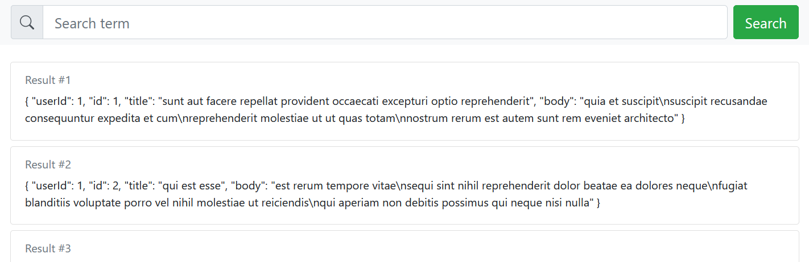

# todo Allgemein
:white_check_mark: Funktionalität, Suchen mit Fehlerakzeptanz (aktuell von Hamming Abstand von 2)   
:white_check_mark: Sortieren der Ergebnisse Nach #Video, #Follower, und Relevanz( Score)    
:white_large_square: Alles auf AWS zum laufen bekommen :clock9:  
:white_large_square: Filter von Ergebnissen (siehe Todo Front+Backend)

## Bonus
:white_large_square: auf die Cards klicken, dann wird der Kanal Beschreibung angezeigt zu werden  
:white_large_square: Basis 10 Elemente neue Seiten mit Formm 10 - 20 (size)   
:white_check_mark: Live Suche :shipit:  
:white_large_square: :heavy_dollar_sign: Live autokomplition  
:white_large_square: :heavy_dollar_sign: `type ahead` Vorschläge mehre Anzeigen in Liste  
:white_large_square: Filter Dropdown Artig (ein Button für alles?)Platzsparender  

# Todo Frontend
:white_check_mark: Error Handling Server   
:white_check_mark: Bei Starten der Seite gleich Inhalte laden (load on Startup)   
:white_check_mark: Einfügen eigener CSS   
:white_large_square: Einfügen von Filter nach Join Datum Range  
:white_large_square: Einfügen von Filter nach Video Range  
:white_large_square: Einfügen von Filter nach Follower Range  
:white_large_square: Einfügen von Filter nach Land  
:white_large_square: Zurücksetzten aller Filter Button    
:white_large_square: Allgemeines Desing anpassen  
:white_large_square: Anzeige eines alternativen Suchbegriffs, der vom Backend vorgeschlagen wird

# Todo Backend
:white_check_mark: Basis Connection  
:white_check_mark: Basis Search  
:white_check_mark: Fuzzy Search  
:white_check_mark: Sorting Search  
:white_check_mark: Relavanze Sorting Search  
:white_large_square: Filter Search  
:white_large_square: Video Range Search  
:white_large_square: Follower Range Search  
:white_large_square: Join Datum Range Search   
:white_large_square: Generierung von Vorschlägen Begriff um Frontend zu senden

# Frontend für Suchapplikation

Ein minimales Beispiel für ein Suchapplikation-Frontend mit Vue.js.

Die Website besteht aus einer Suchleiste, deren Eingabe nach Bestätigung an ein Backend gesandt wird. Als Ergebnis wird ein JSON-Array erwartet, dessen Objekte dann aufgelistet werden.

## Abhängigkeiten installieren 

Es wird node.js und npm benötigt. Bitte stellen Sie sicher, dass eine aktuelle Version installiert ist. Anschließend werden die benötigten Abhängigkeiten mit folgendem Terminal-Befehl installiert: `npm install`

## Entwicklungsserver

Zur Entwicklung empfiehlt sich die Verwendung eines lokalen Hot-reload-Servers, der Änderungen an Dateien direkt
widerspiegelt ohne den Server neu starten zu müssen. Er kann mit dem Befehl `npm run serve` gestartet werden und
ist anschließend über die Adresse `localhost:8080` in einem Webbrowser erreichbar.

## Kompilieren für Produktionscode

Führen Sie `npm run build` in einem Terminal aus. Der Produktionscode wird dann in dem Ordner `/dist` abgelegt
und kann anschließend in einen S3-Bucket hochgeladen werden.

## Running des Backend Codes
- Navigieren in `cd backend` ausfüren von npm Installation Abhänigkeiten
- Installation von Elastic Search Body Parser `npm install express body-parser elasticsearch cors --save`
- Installation von Elastic Search `npm install elastic-builder --savee`
- Ausführen mit `npm app.js`

## Projektaufbau

Vue.js erleichtert die Websiteentwicklung erheblich und ist ähnlich wie das sehr bekannte Framework React, aber leichter zu erlenen. Für eine Einführung, siehe https://vuejs.org/v2/guide/#Getting-Started. Neben Vue.js verwenden wir hier die Bibliothek BooststapVue, welche schon viele nützliche Komponenten zu Verfügung stellt, die Sie verwenden können (aber natürlich nicht müssen). Eine Übersicht aller zur Verfügung stehenden Komponenten findet sich hier: https://bootstrap-vue.org/docs/components. Wir verwenden im Projekt auch einige Bootstrap-CSS-Klassen.

Für den Anfang wurden zwei Komponenten definiert:
- Die Suchleiste
- Ergebnis-Objekt, welches für jedes Suchergebnis im erhaltenen JSON-Array angezeigt wird.

In `src/App.vue` benutzen wird die zuvor definierten Komponenten und bauen daraus die Seite. Hier halten wir auch den Zustand mit dem derzeitigen Suchbegriff und den Ergbnissen.

## Ideen zur Verbesserung

Die Seite hat noch deutlich Verbesserungspotential. Hier ein paar Ideen, die Sie umsetzen könnten:

- Anzeige, wenn Ergebnisse vom Backend abgerufen werden (z.B. mit der Komponente `<b-spinner>` von BootstrapVue)
- Schönere Darstellung der Ergebnisse. (Bei Filmen könnte man z.B. auch immer das jeweilige Filmcover darstellen.)
- Möglichkeit, die Suche mit Filtern besser einzuschränken. Am besten, Sie geben neben dem eigentlich Suchwort die Filtereinstellungen dann auch an das Backend mit. Dazu muss das Backend aber damit umgehen können. Alternativ können Sie auch client-seitig die erhaltenen Ergebnisse filtern.
- Anzeige eines alternativen Suchbegriffs, der vom Backend vorgeschlagen wird (wie bei Google-Suche "Meinten Sie: ...")
- Fehlerbehandlung, wenn das Backend nicht erreicht werden kann.
- Anzeige eines Dropdown mit möglichen Vervollständigungen des Suchbegriffs (Stichwort `type ahead`)
- Pagination der Suchergebnisse: Die Liste der Suchergebnisse kann sehr lang werden und ist dann umständlich zu bedienen: Besser wäre dann eine Aufteilung auf mehrere Seiten.
